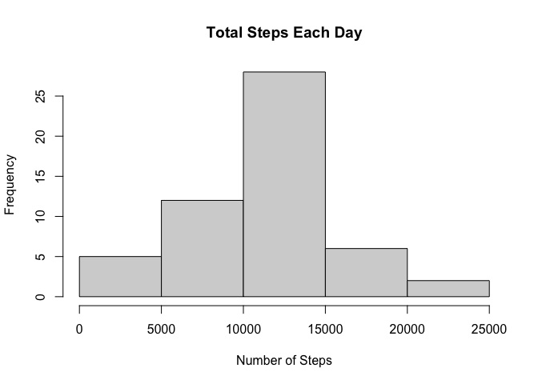
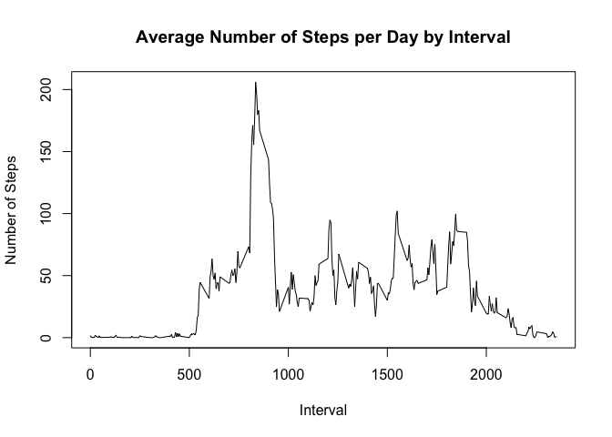
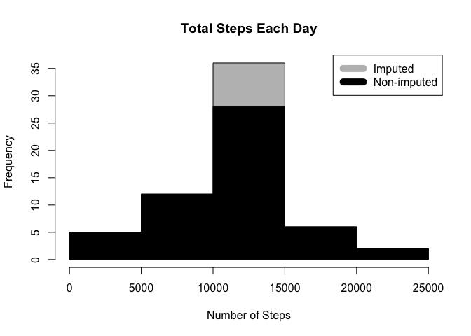

## Loading and preprocessing the data


## What is mean total number of steps taken per day?

<!-- -->

### Mean

```
## [1] 10766.19
```

### Median

```
## [1] 10765
```

## What is the average daily activity pattern?

<!-- -->

### Interval with most average steps

```
## [1] 835
```

## Imputing missing values

### Total Missing Values

```
## [1] 2304
```


<!-- -->
### Mean

```
## [1] 10766.19
```

### Median

```
## [1] 10766.19
```

### Diff in Median

```
## [1] 1.188679
```

### Diff in Mean

```
## [1] 0
```
## Are there differences in activity patterns between weekdays and weekends?

<!-- -->

